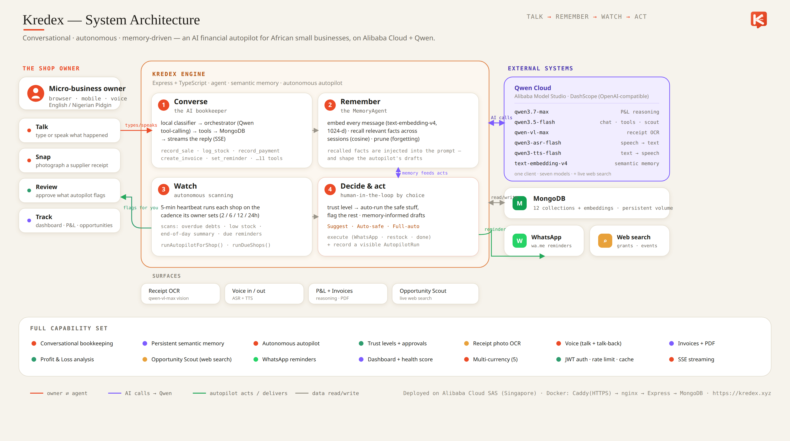

# Kredex — AI Financial Autopilot for African Small Businesses

> An AI agent that runs the books for a micro-business by conversation. The owner
> just says what happened — in plain English or Nigerian Pidgin, typed or spoken —
> and Kredex records the sale, tracks the debt, watches the stock, and drafts the
> reminder. It **remembers** what you tell it across sessions (semantic memory),
> then **acts on its own** — scanning for overdue debts, low stock, and due
> reminders — and waits for your **yes** before anything goes out. Every action is
> shaped by what it remembers and logged on a visible timeline.

Built for the **Global AI Hackathon Series with Qwen Cloud** — **Autopilot Agent** track.


**Kredex is free and open source (MIT).** Contributions are welcome — see
[Contributing](#contributing).

---

## Live

- 🌐 **Live app** — https://kredex.xyz
- ☁️ **On Alibaba Cloud** — http://8.222.241.247 (Simple Application Server, Singapore)
- 🐦 **Twitter / X** — https://x.com/getkredex
- 🎥 **Demo video** — _add link before submission_
- 🗺️ **Architecture** — see [Architecture](#architecture) below
- 💻 **Repo** — https://github.com/shegz101/kredex

---

## Table of Contents

- [Quick Path](#quick-path)
- [Why It Stands Out](#why-it-stands-out)
- [What it does](#what-it-does)
- [Architecture](#architecture)
- [The agent layer](#the-agent-layer)
- [Requirements](#requirements)
- [Run with Docker (easiest)](#run-with-docker-easiest)
- [Local development (without Docker)](#local-development-without-docker)
- [Usage](#usage)
- [Deployment](#deployment)
- [Project layout](#project-layout)
- [Contributing](#contributing)
- [License](#license)

---

## Quick Path

**Fastest — with Docker** (only needs Docker + a Qwen API key; MongoDB runs in a
container, nothing else to install):

```bash
cp .env.example .env      # add QWEN_API_KEY + JWT_SECRET (details below)
docker compose up -d --build web server mongo
```

Then open **`http://localhost:8080`**.

**Or run it natively** (Node + a local or Atlas MongoDB):

```bash
cp server/.env.example server/.env   # QWEN_API_KEY · MONGODB_URI · JWT_SECRET
npm run install:all
npm run dev                          # Vite :5173 + Express :3001
```

Then open **`http://localhost:5173`**.

Either way, register a shop and tell Kredex:

```text
> sold 3 bags of rice for 4500 each
> Musa carry 2 crates of coke, e go pay Friday
> remind me to call my supplier on Monday
> warn me when milk is below 10
```

---

## Why It Stands Out

Kredex is built for the Autopilot Agent track because it does three things
together that most "AI bookkeeping" demos don't:

- **It has real, persistent memory — not just a chat window.** Everything the
  owner tells Kredex is embedded and semantically recalled across sessions, so it
  behaves like a bookkeeper who actually *knows* your shop and your customers.
- **It acts autonomously, at the trust level you set.** On a schedule the owner
  chooses, Kredex scans for overdue debts, low stock, and the day's numbers — then
  *acts on the safe stuff itself* and *flags the rest* for approval. You pick how
  much it does on its own (from "ask me everything" to "handle it").
- **Memory and autopilot are fused.** When Kredex drafts a payment reminder, it
  uses what it remembers about that customer to set the tone — "always pays late
  but always pays" produces a patient message, not a pushy one — and shows you the
  exact memory that shaped it.

It speaks the owner's language (English + Nigerian Pidgin, typed **or spoken**),
reads receipt photos, and runs entirely on **Qwen** models via Alibaba Model Studio.

## What it does

- **Conversational bookkeeping** — the owner says what happened and Kredex does the
  accounting. A cheap local classifier routes the intent, then a Qwen tool-calling
  agent runs the right action against MongoDB and confirms in a sentence or two.
  Tools: `record_sale`, `record_credit_sale`, `record_payment`, `record_expense`,
  `log_stock`, `create_invoice`, `save_customer_phone`, `set_reminder`,
  `query_debts`, `query_stock`, `daily_summary`.
- **Persistent semantic memory (MemoryAgent)** — every message is embedded with
  `text-embedding-v4` (1024-dim) and stored; each new turn semantically recalls the
  most relevant past facts (cosine similarity) and injects them into the agent's
  context. Bounded by a per-shop cap with oldest-first pruning ("forgetting").
- **Autonomous autopilot with trust levels** — a 5-minute heartbeat runs each shop
  on the **cadence its owner sets** (2h / 6h / 12h / 24h) — not a fixed clock. Each
  run scans for overdue debts, low stock, end-of-day summaries, and due reminders,
  then acts by the shop's **autonomy level**:
  - **Suggest** — everything waits for approval.
  - **Auto-safe** (default) — low-risk actions (restock, day summary) run
    themselves; anything that messages a customer still asks first.
  - **Full auto** — the autopilot also resolves customer reminders on its own.
- **Autopilot runs feed** — every autonomous pass is recorded and shown: what it
  *detected*, what it *did itself*, and what it *flagged* — e.g. *"Kredex auto-added
  1 item to restock, logged the day's summary. Flagged 1 debt for your approval."*
  Proof the agent worked while you were away.
- **Memory-informed reminder drafting** — overdue-debt reminders are written by
  Qwen using recalled facts about the customer, tone-matched, with a safe template
  fallback. The memory used is shown on the card as **"🧠 Kredex remembered: …"**.
- **Real execution** — a debt reminder opens a free WhatsApp (`wa.me`) message and
  records it was sent; a low-stock alert puts the item on a **Restock list**; a
  reminder marks done. Whether that happens automatically or on your tap depends on
  the trust level.
- **Approval feed + activity timeline** — anything the autopilot flags lands in a
  human-in-the-loop approval feed, and a lifecycle timeline (detected → decided +
  memory used → checkpoint → action) shows the whole loop.
- **Receipt photo OCR** — snap a supplier receipt; `qwen-vl-max` extracts
  structured line items to confirm and log.
- **Voice, both ways** — speak your entries (`qwen3-asr-flash`, speech-to-text) and
  have Kredex read replies aloud (`qwen3-tts-flash`, text-to-speech).
- **Invoices + PDF** — generate numbered invoices from chat or UI, mark paid/unpaid,
  download as PDF.
- **Profit & Loss analysis** — the flagship `qwen3.7-max` reasons over revenue,
  COGS, and expenses to give a plain-language "are you making money?" verdict.
- **Opportunity Scout** — finds grants, business events, and empowerment programs
  relevant to the shop via Qwen **live web search**, with source links and a cached,
  animated radar UI.
- **Dashboard & business health** — revenue chart, stat cards, low-stock and
  needs-attention panels, and a 0–100 business-health score (Strong / Good / Watch
  / At risk).
- **Currency-aware everywhere** — NGN / USD / GHS / KES / ZAR propagates across the
  dashboard, chat, invoices, and autopilot drafts.
- **Production hardening** — JWT auth (bcrypt, live email-taken check, password
  reset), rate limiting, SSE-safe gzip compression, in-memory TTL caching, and
  validated environment config.

## Architecture

Kredex is a **conversational, autonomous, memory-driven** agent. The owner *talks*
(types, speaks, or snaps a receipt); the engine logs it, *remembers* it across
sessions, and — on a cadence the owner sets — *watches* the shop and *acts* within
the trust level the owner chose. Every AI call goes to **Qwen** (Alibaba Model
Studio / DashScope) through one OpenAI-compatible client, and the whole stack is
deployed on **Alibaba Cloud**.



> Deployment: Browser → Caddy (HTTPS) → nginx → Express → MongoDB, on Alibaba Cloud.
> Vector source: [`architecture-overview.svg`](docs/assets/architecture-overview.svg)

**The Qwen model map** (`server/src/lib/qwen.ts` — one edit swaps a version):

| Model | Role in Kredex |
|---|---|
| `qwen3.7-max` | Deep P&L / profit reasoning |
| `qwen3.5-flash` | Chat tool-calling, opportunity scout |
| `qwen-vl-max` | Receipt photo OCR |
| `qwen3-asr-flash` | Speech-to-text (voice logging) |
| `qwen3-tts-flash` | Text-to-speech (talk-back) |
| `qwen3.5-omni-flash` | Voice (omni path) |
| `text-embedding-v4` | Semantic memory + fuzzy item matching |

## The agent layer

The heart of Kredex is a small, legible loop that fuses **memory** into
**autonomy**:

```text
Owner message
  -> local classifier (cheap intent guess, no LLM)
  -> orchestrator: recall relevant memories  ──►  Qwen (tool-calling)
       -> run tools against MongoDB
       -> stream the reply
  -> remember: embed + store the message for next time

Autopilot run (heartbeat every 5m, per-shop cadence / on-demand)
  -> detect overdue debt / low stock / EOD summary / due reminder
  -> draft (memory-informed) each action
  -> apply trust level: auto-run the safe stuff, flag the rest for approval
  -> execute (WhatsApp / restock list / done) + record an AutopilotRun
  -> the owner approves anything that was flagged
```

- `server/src/agents/orchestrator.ts` — the Qwen tool-calling loop; injects recalled
  memories into the system prompt.
- `server/src/services/memory.ts` — `remember()` / `recall()` / `prune()`.
- `server/src/services/autopilot.ts` — scanners, memory-informed drafting,
  `executeApproval()`, and `runAutopilotForShop()` / `runDueShops()` (the scheduler).

## Requirements

The only thing you always need is a **Qwen Cloud API key** — from Alibaba
**Model Studio** (DashScope), the OpenAI-compatible endpoint. Then pick a path:

- **Docker path (easiest):** Docker + Docker Compose. MongoDB runs in a container.
- **Native path:** Node.js 20+ (developed on 24), npm, and MongoDB (local or a free
  Atlas cluster).

Get the API key at the Alibaba Cloud Model Studio console. Use a **pay-as-you-go**
key (`sk-…`) with the `dashscope-intl` endpoint — a Token-Plan key (`sk-sp-…`) is
for interactive tools only and will `401` against a backend.

## Run with Docker (easiest)

The whole stack — **nginx (web)**, the **Express API**, and **MongoDB** — is
containerized, so one command runs everything locally. No Node, no local Mongo.

**1. Configure secrets** — copy the root template and fill in two values:

```bash
cp .env.example .env
```

`.env` (repo root) needs only:

| Variable | What to put |
|---|---|
| `QWEN_API_KEY` | your `sk-…` key from Alibaba Model Studio |
| `QWEN_BASE_URL` | leave as the default `https://dashscope-intl.aliyuncs.com/compatible-mode/v1` |
| `JWT_SECRET` | any long random string — `openssl rand -hex 32` |

> `MONGODB_URI` is **not** set here — Compose points the API at the bundled Mongo
> container automatically (`mongodb://mongo:27017/kredex`).

**2. Build and run:**

```bash
docker compose up -d --build web server mongo
```

**3. Open http://localhost:8080** and register a shop.

Handy:

```bash
docker compose ps                 # service status
docker compose logs -f server     # follow the API logs
docker compose down               # stop (keeps the mongo_data volume)
```

> The compose file also defines a `caddy` service for production HTTPS — you can
> ignore it locally (that's why the command above lists only `web server mongo`).
> Running the whole stack in production is covered in [Deployment](#deployment).

## Local development (without Docker)

Prefer running the code directly (hot reload, no containers)?

### 1. Configure environment
```bash
cp server/.env.example server/.env
```
Fill in `server/.env`:
- `QWEN_API_KEY` — from the Alibaba Cloud Model Studio console
- `QWEN_BASE_URL` — defaults to `https://dashscope-intl.aliyuncs.com/compatible-mode/v1`
- `MONGODB_URI` — local (`mongodb://127.0.0.1:27017/kredex`) or Atlas connection string
- `JWT_SECRET` — a long random string:
  `node -e "console.log(require('crypto').randomBytes(32).toString('hex'))"`
- `PORT` — defaults to `3001`

### 2. Start MongoDB (if running locally)
```bash
sudo systemctl start mongod   # Linux; or run mongod / use MongoDB Atlas
```

### 3. Install and run
```bash
npm run install:all   # installs root, client, and server deps
npm run dev           # Express on :3001 + Vite on :5173, together
```

Open `http://localhost:5173` and register a shop.

## Usage

```bash
# Run both dev servers (client + server) with colored logs
npm run dev

# Run one side only
npm run dev:server
npm run dev:client

# Production build (client bundle + server tsc)
npm run build

# Verify the Qwen connection
npm --prefix server run ping:qwen
```

Try these in the chat once you're logged in:

```text
> sold 5 loaves of bread at 800 each
> Amaka took 3 cartons of milk on credit, due next week
> she paid 2000 today
> I paid 1500 for transport
> how much does Amaka owe me?
> what's low in stock?
> are you making money this month?
```

Then open **Autopilot**, set your cadence and trust level, and hit **Run now** to
see the run recorded and the approvals, restock list, and activity timeline populate.

## Deployment

Kredex is deployed as one Docker Compose stack on a single **Alibaba Cloud** Simple
Application Server (Singapore). In production a fourth service — **Caddy** — is the
public entry point: it terminates HTTPS with an auto-renewing Let's Encrypt
certificate and reverse-proxies to nginx.

```bash
# on the server, once .env holds QWEN_API_KEY + JWT_SECRET
docker compose up -d --build     # starts caddy + web + server + mongo
```

Caddy serves the domain from the [`Caddyfile`](Caddyfile) (`kredex.xyz`). To ship a
change: `git pull && docker compose up -d --build`. The `mongo_data` volume persists
across rebuilds. Live at **https://kredex.xyz**.

## Project layout

```
server/src/
  index.ts             # Express app: middleware, route mounts, autopilot heartbeat
  config/env.ts        # validated environment (fails loud on missing vars)
  agents/
    orchestrator.ts    # Qwen tool-calling agent loop + memory recall injection
    tools.ts           # function-calling tools (record_sale, log_stock, create_invoice…)
  services/
    memory.ts          # MemoryAgent: remember() / recall() / prune() (embeddings)
    autopilot.ts       # scanners · memory-informed drafting · autonomy · runAutopilotForShop
  lib/
    qwen.ts            # one OpenAI-compatible DashScope client + central model map
    embeddings.ts      # embed() + cosine() for semantic memory
    classifier.ts      # cheap local intent classifier (pre-LLM routing)
    cache.ts           # in-memory TTL cache        rateLimit.ts # api/auth/ai limiters
    money.ts           # currency formatting        stock.ts     # low-stock helpers
    jwt.ts             # sign/verify tokens          invoicePdf.ts# PDF generation
    db.ts              # Mongoose connection
  models/              # 12 Mongoose schemas incl. Memory.ts, Approval.ts, AutopilotRun.ts
  routes/              # auth · chat · dashboard · autopilot · receipt · pnl ·
                       # invoices · settings · reminders · voice · opportunities
  middleware/auth.ts   # requireAuth (JWT)

client/src/
  Landing.tsx · App.tsx · main.tsx
  pages/               # Login · Register · ForgotPassword
  components/
    dashboard/         # DashboardPage · ChatPage · AutopilotPage · PnlPage ·
                       # InvoicesPage · OpportunitiesPage · RemindersPage ·
                       # SettingsPage · Sidebar · NotificationsDrawer · …
    Toast.tsx · …
  lib/api.ts           # typed API client (REST + SSE)
  hooks/ · utils/
```

## Contributing

Contributions are welcome — bug reports, features, docs, and translations. See
[`CONTRIBUTING.md`](CONTRIBUTING.md) for the full guide; the short version:

1. **Open an issue** first for anything non-trivial, so we can agree on the approach.
2. **Fork** the repo and create a branch: `git checkout -b feat/your-thing`.
3. Get it running with the [Docker](#run-with-docker-easiest) or
   [native](#local-development-without-docker) path above.
4. Keep the code style of the surrounding files. Type-check before pushing:
   `npm --prefix server run build` and `npm --prefix client run typecheck`.
5. **Open a pull request** describing what changed and why. Link the issue.

Good first areas: more languages/locales beyond English & Pidgin, additional
currencies, new autopilot scanners, and test coverage. Be respectful and
constructive — this project exists to help real small businesses.

## License

**MIT** — free to use, modify, and distribute. See [`LICENSE`](LICENSE).
```
