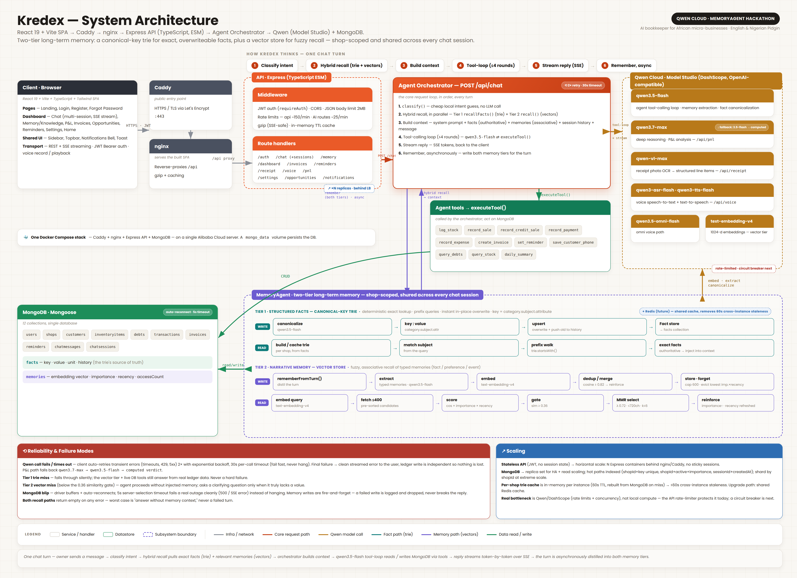

# Kredex — The AI Bookkeeper That Remembers Your Shop

> An AI bookkeeper for African micro-businesses that you run by **conversation** —
> and that **remembers**. The owner just says what happened (in English or Nigerian
> Pidgin, typed or spoken) and Kredex records the sale, tracks the debt, and answers
> questions. Crucially, it distils every conversation into durable, typed memories —
> your customers' payment habits, your preferences, standing instructions — recalls
> the **critical few** across sessions, **reinforces** what it uses, and **forgets**
> what goes stale. So it gets sharper about your shop every day.

Built for the **Global AI Hackathon Series with Qwen Cloud** — **MemoryAgent** track.


**Kredex is free and open source (MIT).** Contributions are welcome — see
[Contributing](#contributing).

---

## Live

- 🌐 **Live app** — https://kredex.xyz
- 📖 **Docs** — https://kredex.xyz/docs
- ☁️ **On Alibaba Cloud** — http://8.222.241.247 (Simple Application Server, Singapore)
- 🐦 **Twitter / X** — https://x.com/getkredex
- 🎥 **Demo video** — https://youtu.be/DJKaI3UKsQY
- 🗺️ **Architecture** — see [Architecture](#architecture) below
- 💻 **Repo** — https://github.com/shegz101/kredex

---

## Table of Contents

- [Quick Path](#quick-path)
- [Why It Stands Out](#why-it-stands-out)
- [What it does](#what-it-does)
- [Architecture](#architecture)
- [The agent layer](#the-agent-layer)
- [MCP server](#mcp-server--kredex-as-a-memory-backend-for-any-agent)
- [Memory benchmark](#memory-benchmark)
- [Reliability & scale](#reliability--scale)
- [Requirements](#requirements)
- [Run with Docker (easiest)](#run-with-docker-easiest)
- [Local development (without Docker)](#local-development-without-docker)
- [Usage](#usage)
- [Deployment](#deployment)
- [Project layout](#project-layout)
- [Contributing](#contributing)
- [License](#license)

---

## Quick Path

**Fastest — with Docker** (only needs Docker + a Qwen API key; MongoDB runs in a
container, nothing else to install):

```bash
cp .env.example .env      # add QWEN_API_KEY + JWT_SECRET (details below)
docker compose up -d --build web server mongo
```

Then open **`http://localhost:8080`**.

**Or run it natively** (Node + a local or Atlas MongoDB):

```bash
cp server/.env.example server/.env   # QWEN_API_KEY · MONGODB_URI · JWT_SECRET
npm run install:all
npm run dev                          # Vite :5173 + Express :3001
```

Then open **`http://localhost:5173`**.

Either way, register a shop and tell Kredex:

```text
> sold 3 bags of rice for 4500 each
> Musa carry 2 crates of coke, e go pay Friday
> remind me to call my supplier on Monday
> warn me when milk is below 10
```

---

## Why It Stands Out

Kredex is built for the **MemoryAgent** track: a genuine, optimized long-term
memory architecture — not a chat window with history.

- **Two-tier memory — the right data structure for each job.** Structured facts
  (prices, supplier terms, phone numbers, reorder levels) live in a **canonical-key
  trie**: `product.rice.sell_price → 34,000`. That gives **O(key-length)** exact
  lookup, **prefix queries** ("everything about rice" = one subtree walk), and
  **instant in-place overwrite** — say "rice is now ₦34,000" and the old value is
  superseded (kept in history), deterministically, no fuzzy match. Messy, narrative
  knowledge that *can't* be keyed ("Tunde grumbles but always pays") lives in a
  **vector store**. The agent trusts the trie for exact values and the vectors for
  associative recall. (`server/src/lib/trie.ts`, `server/src/services/facts.ts`)
- **One brain, many conversations.** Both tiers are **shop-scoped and shared across
  every chat session** — tell Kredex something in one chat and it's known in all the
  others. Sessions only scope the short-term replay; long-term memory is global.
- **Structured extraction, not raw logs.** Every turn is distilled by a model pass:
  a **canonicalizer** emits keyed facts for the trie, while a separate extractor
  produces durable, typed memories — *facts*, *preferences*, *events* — for the
  vector tier. Transient transactions are ignored, so memory stays clean.
- **Optimized retrieval within a limited context window.** Vector recall scores each
  memory by **cosine × importance × recency**, then uses **MMR** to select a
  diverse, non-redundant set under a **token budget** — the *critical few*, not just
  the top cosine match.
- **It learns, and it forgets — on time.** Recalled memories are **reinforced**
  (importance ↑, recency refreshed) and near-duplicates **merge**. Forgetting is
  two-layered: **time-based decay** retires low-importance memories left untouched for
  months (soft-deactivated, so it's auditable — pinned/important ones are never
  touched), and a **cap** hard-evicts the lowest importance×recency memories past a
  ceiling. Structured facts forget *by overwrite* — a corrected price supersedes the
  old value, which is kept in history. A built-in **Memory / knowledge tab** lets you
  watch both tiers — the fact trie as a grouped tree, the vector memories with a
  live recall tester.

- **Reusable over MCP.** The whole two-tier memory (plus bookkeeping) is exposed as a
  **Model Context Protocol server** — 17 tools reusing the *same* registry that drives
  the in-app Qwen agent — so any MCP client (Claude Desktop, an IDE agent) can use
  Kredex as a durable memory backend. See [MCP server](#mcp-server--kredex-as-a-memory-backend-for-any-agent).

It speaks the owner's language (English + Nigerian Pidgin, typed **or spoken**),
reads receipt photos, and runs entirely on **Qwen** models via Alibaba Model Studio.

## What it does

- **Conversational bookkeeping** — the owner says what happened and Kredex does the
  accounting. A cheap local classifier routes the intent, then a Qwen tool-calling
  agent runs the right action against MongoDB and confirms in a sentence or two.
  Tools: `record_sale`, `record_credit_sale`, `record_payment`, `record_expense`,
  `log_stock`, `create_invoice`, `save_customer_phone`, `set_reminder`,
  `query_debts`, `query_stock`, `daily_summary`.
- **Two-tier long-term memory (the MemoryAgent core)** — every turn feeds both:
  **Tier 1**, a **canonical-key trie** of structured facts (`facts.ts`, backed by a
  unique-keyed `Fact` collection) for deterministic lookup, prefix queries, and
  in-place overwrite; and **Tier 2**, a **vector store** of typed memories embedded
  with `text-embedding-v4` (1024-dim), recalled by **cosine × importance × recency**
  + **MMR** under a token budget, **reinforced** on use, deduped and evicted when
  stale (`server/src/services/memory.ts`). Both are **shop-scoped**, so they persist
  and update across every chat session.
- **Multiple chat sessions** — owners keep separate conversation threads (like
  ChatGPT chats); memory is shared across all of them. Short-term replay is
  per-thread; long-term recall is global. (`ChatSession` model + `/api/chat/sessions`)
- **Memory / knowledge tab** — a dedicated page shows both tiers: the structured
  facts as a grouped tree (Products › rice › sell price ₦34,000, with an "overwritten
  N×" badge), and the narrative memories with a **live recall tester** that scores
  what a query retrieves.
- **Memory-aware answers** — the trie's exact facts (authoritative) and the vector
  tier's associative recall are both injected into the agent's context, so Kredex
  answers with real, up-to-date knowledge of your shop — and gets sharper with use.
- **Receipt photo OCR** — snap a supplier receipt; `qwen-vl-max` extracts
  structured line items to confirm and log.
- **Voice, both ways** — speak your entries (`qwen3-asr-flash`, speech-to-text) and
  have Kredex read replies aloud (`qwen3-tts-flash`, text-to-speech).
- **Invoices + PDF** — generate numbered invoices from chat or UI, mark paid/unpaid,
  download as PDF.
- **Profit & Loss analysis** — the flagship `qwen3.7-max` reasons over revenue,
  COGS, and expenses to give a plain-language "are you making money?" verdict.
- **Opportunity Scout** — finds grants, business events, and empowerment programs
  relevant to the shop via Qwen **live web search**, with source links and a cached,
  animated radar UI.
- **Dashboard & business health** — revenue chart, stat cards, low-stock and
  needs-attention panels, and a 0–100 business-health score (Strong / Good / Watch
  / At risk).
- **Notifications** — a live alerts bell surfaces reminders that have fallen due,
  stock at/below its reorder level, and credit payments whose due date has arrived.
  Each alert is recomputed from the shop's real data — nothing autonomous.
  (`server/src/routes/notifications.routes.ts`)
- **Currency-aware everywhere** — NGN / USD / GHS / KES / ZAR propagates across the
  dashboard, chat, and invoices.
- **Production hardening** — JWT auth (bcrypt, live email-taken check, password
  reset), rate limiting, SSE-safe gzip compression, in-memory TTL caching, and
  validated environment config.

## Architecture

Kredex is a **conversational, memory-driven** agent. The owner *talks* (types,
speaks, or snaps a receipt); the engine logs it to MongoDB, **distils durable
memories** from the conversation into two tiers — a **canonical-key trie** of exact
facts and a **vector store** of narrative memory — and performs **hybrid recall**
(exact facts + semantic memories) on every new turn. Every AI call goes to **Qwen**
(Alibaba Model Studio / DashScope) through one OpenAI-compatible client, and the
whole stack is deployed on **Alibaba Cloud**.



> Deployment: Browser → Caddy (HTTPS) → nginx → Express → MongoDB, on Alibaba Cloud.

**The Qwen model map** (`server/src/lib/qwen.ts` — one edit swaps a version):

| Model | Role in Kredex |
|---|---|
| `qwen3.7-max` | Deep P&L / profit reasoning |
| `qwen3.5-flash` | Chat tool-calling, opportunity scout, memory extraction + fact canonicalization |
| `qwen-vl-max` | Receipt photo OCR |
| `qwen3-asr-flash` | Speech-to-text (voice logging) |
| `qwen3-tts-flash` | Text-to-speech (talk-back) |
| `qwen3.5-omni-flash` | Voice (omni path) |
| `text-embedding-v4` | Semantic memory + fuzzy item matching |

## The agent layer

The heart of Kredex is a **two-tier memory loop** wrapped around a tool-calling agent:

```text
Owner message  (in some chat session)
  -> local classifier (cheap intent guess, no LLM)
  -> HYBRID RECALL (shop-wide, across all sessions):
       Tier 1 · recallFacts(): match query subjects → trie prefix walk → exact facts
       Tier 2 · recall():      cosine × importance × recency → MMR under a token budget
       → inject facts (authoritative) + memories (associative) into context
  -> Qwen tool-calling loop -> run tools against MongoDB -> stream the reply
  -> WRITE both tiers · async:
       rememberFactsFromTurn(): canonicalize → key:value → upsert (overwrite + history)
       rememberFromTurn():      extract typed memories → embed → dedup/merge → forget
```

- `server/src/agents/orchestrator.ts` — the Qwen tool-calling loop; runs hybrid recall and injects facts + memories into the system prompt.
- `server/src/lib/trie.ts` — the **canonical-key trie** (insert/search/startsWith/delete) powering exact fact lookup, prefix queries, and overwrite.
- `server/src/services/facts.ts` — Tier 1: `rememberFactsFromTurn()` (canonicalizer), `upsertFact()` (overwrite + history), `recallFacts()` (subject match → prefix walk), per-shop trie cache.
- `server/src/services/memory.ts` — Tier 2: `rememberFromTurn()` (extraction), `recall()` (scored + MMR + reinforcement), `forget()` (eviction), `listMemories()`.
- `server/src/lib/embeddings.ts` — `embed()` + `cosine()`.
- `server/src/routes/memory.routes.ts` — the Memory / knowledge tab API (facts + memories, recall preview, forget).

## MCP server — Kredex as a memory backend for any agent

Kredex ships a **Model Context Protocol (MCP) server** that exposes a shop's
**two-tier memory** and **bookkeeping tools** as first-class MCP tools — so any MCP
client (Claude Desktop, an IDE agent, another LLM app) can use Kredex as a durable
**memory + bookkeeping backend**, not just our own UI.

- **One tool registry, two front-ends.** The bookkeeping tools aren't redefined for
  MCP — the server reuses the *exact same* `toolDefs` + `executeTool` registry that
  powers the in-app Qwen agent (OpenAI function schema maps 1:1 to MCP's JSON-Schema
  `inputSchema`). One source of truth, exposed to both Qwen function-calling and MCP.
- **The memory tier is the star.** On top of the 11 bookkeeping tools it adds 6
  memory tools — **17 total**: `recall_facts` / `remember_fact` / `list_facts` (Tier 1,
  the canonical-key trie, with overwrite-supersede semantics), and `recall_memories` /
  `remember` / `list_memories` (Tier 2, the scored + reinforced vector store).
- **Shop-scoped.** The server binds to one shop via `KREDEX_SHOP_ID`, and every tool
  is scoped to that shop — an MCP client can only touch its own data.

Run it (stdio transport):

```bash
KREDEX_SHOP_ID=<your-shop-id> npm --prefix server run mcp
```

Wire it into an MCP client (e.g. Claude Desktop `claude_desktop_config.json`):

```json
{
  "mcpServers": {
    "kredex": {
      "command": "npm",
      "args": ["--prefix", "/absolute/path/to/kredex/server", "run", "mcp"],
      "env": { "KREDEX_SHOP_ID": "<your-shop-id>", "MONGODB_URI": "mongodb://127.0.0.1:27017/kredex" }
    }
  }
}
```

Implementation: `server/src/mcp/server.ts`.

## Memory benchmark

Numbers back the design. These are **measured** on a dev machine (single-threaded
Node), reproduce with `npm --prefix server run bench` (pure — no DB or API key):

**Tier 1 — structured facts (canonical-key trie) vs. the naive baseline (a flat array
scanned linearly):**

| Facts | Exact lookup (trie) | Exact lookup (array scan) | Overwrite (trie) | Prefix recall (trie) |
|---|---|---|---|---|
| 300 | 2.7 µs | 5.8 µs | 3.7 µs | 3.4 µs |
| 3,000 | 2.3 µs | 53.6 µs | 2.0 µs | 2.7 µs |
| 30,000 | 3.7 µs | 1,283.9 µs | 6.3 µs | 4.8 µs |

The trie stays **flat in the microseconds** as facts grow — lookup, in-place
overwrite, and "everything about X" prefix recall are all **O(key-length)**,
independent of how many facts a shop has. The linear scan grows with the data and is
**~350× slower at 30k facts**, with the gap widening. This is why exact facts live in
a trie, not a list.

**Tier 2 — vector recall:**

- Scoring the full candidate set (**400 memories × 1024-d** cosine) per recall:
  **~2.4 ms** (~6 µs/candidate) — the whole semantic ranking, before MMR selection.
- **Critical-few context budget:** a shop at the 600-memory cap holds ~54,000
  characters of raw memory; recall injects **at most 720 characters (~180 tokens)** of
  the most relevant, diverse few — **~98.7% less context**, bounded no matter how much
  the shop accumulates. That's the "recall the critical few within a limited context
  window" requirement, by construction.

## Reliability & scale

Kredex is designed to **degrade gracefully** — an owner logging a sale should never
see a stack trace because an AI call blipped.

**Failure modes (what happens when a dependency misbehaves):**

- **A Qwen call fails or times out.** The OpenAI-compatible client auto-retries
  transient errors (timeouts, 429s, 5xx) **twice with exponential backoff**, and caps
  each call at a **30s timeout** so a hung upstream fails fast instead of stalling the
  request (`server/src/lib/qwen.ts`). If it still fails, the chat route emits a clean
  SSE `error` event — the owner is asked to retry and **no data is lost** (the ledger
  write is separate from the reply). The heavy P&L path uses `completeWithFallback`:
  `qwen3.7-max` → `qwen3.5-flash` → a computed plain-text verdict, so a verdict always
  comes back.
- **A trie miss (structured fact not found).** Recall silently **falls through** — the
  vector tier runs in parallel, and the agent still has **live tools** that query the
  real ledger. So "how much did I sell rice for?" is answered from actual transactions
  even with no stored fact. Never a hard failure.
- **A vector miss (nothing above the similarity gate).** The agent simply **proceeds
  without injected memory** — it still has the system prompt and tools, and asks a
  clarifying question only when it genuinely lacks a specific value.
- **MongoDB blips.** The Mongoose driver **buffers commands and auto-reconnects**
  through brief interruptions; a short `serverSelectionTimeoutMS` means a real outage
  fails a request **cleanly** (caught by the route → 500 / SSE error) rather than
  hanging. Long-term **memory writes are best-effort and fire-and-forget** — a failed
  write is logged and dropped; it never breaks the owner's reply.

Both recall paths are wrapped to **return empty on any error**, so the worst case for
memory is "answer without memory context," not a failed turn.

**Scaling past one VM:**

- **The API is stateless** — JWT auth, no server-side session state — so it scales
  **horizontally**: run N Express containers behind nginx/Caddy with no sticky
  sessions. The current single-VM Docker Compose deployment is the hackathon setup;
  this is the path beyond it.
- **Data tier:** MongoDB → a **replica set** for HA and read scaling; hot paths are
  already indexed (unique `(shopId, key)` on facts; `shopId + active + importance` on
  memories; `sessionId + createdAt` on messages); shard by `shopId` if it ever grows
  that far.
- **One honest caveat:** the per-shop **trie cache is in-memory per instance**. With
  multiple API instances each keeps its own, but it's rebuilt from MongoDB (the source
  of truth) on miss and carries a **60s TTL**, bounding cross-instance staleness to
  ≤60s. The clear upgrade is a shared **Redis** cache.
- **The real bottleneck is Qwen, not our compute** — scaling means concurrency and
  rate limits against DashScope; the built-in rate limiter protects the API, and a
  **circuit breaker** is the natural next step.

## Requirements

The only thing you always need is a **Qwen Cloud API key** — from Alibaba
**Model Studio** (DashScope), the OpenAI-compatible endpoint. Then pick a path:

- **Docker path (easiest):** Docker + Docker Compose. MongoDB runs in a container.
- **Native path:** Node.js 20+ (developed on 24), npm, and MongoDB (local or a free
  Atlas cluster).

Get the API key at the Alibaba Cloud Model Studio console. Use a **pay-as-you-go**
key (`sk-…`) with the `dashscope-intl` endpoint — a Token-Plan key (`sk-sp-…`) is
for interactive tools only and will `401` against a backend.

## Run with Docker (easiest)

The whole stack — **nginx (web)**, the **Express API**, and **MongoDB** — is
containerized, so one command runs everything locally. No Node, no local Mongo.

**1. Configure secrets** — copy the root template and fill in two values:

```bash
cp .env.example .env
```

`.env` (repo root) needs only:

| Variable | What to put |
|---|---|
| `QWEN_API_KEY` | your `sk-…` key from Alibaba Model Studio |
| `QWEN_BASE_URL` | leave as the default `https://dashscope-intl.aliyuncs.com/compatible-mode/v1` |
| `JWT_SECRET` | any long random string — `openssl rand -hex 32` |

> `MONGODB_URI` is **not** set here — Compose points the API at the bundled Mongo
> container automatically (`mongodb://mongo:27017/kredex`).

**2. Build and run:**

```bash
docker compose up -d --build web server mongo
```

**3. Open http://localhost:8080** and register a shop.

Handy:

```bash
docker compose ps                 # service status
docker compose logs -f server     # follow the API logs
docker compose down               # stop (keeps the mongo_data volume)
```

> The compose file also defines a `caddy` service for production HTTPS — you can
> ignore it locally (that's why the command above lists only `web server mongo`).
> Running the whole stack in production is covered in [Deployment](#deployment).

## Local development (without Docker)

Prefer running the code directly (hot reload, no containers)?

### 1. Configure environment
```bash
cp server/.env.example server/.env
```
Fill in `server/.env`:
- `QWEN_API_KEY` — from the Alibaba Cloud Model Studio console
- `QWEN_BASE_URL` — defaults to `https://dashscope-intl.aliyuncs.com/compatible-mode/v1`
- `MONGODB_URI` — local (`mongodb://127.0.0.1:27017/kredex`) or Atlas connection string
- `JWT_SECRET` — a long random string:
  `node -e "console.log(require('crypto').randomBytes(32).toString('hex'))"`
- `PORT` — defaults to `3001`

### 2. Start MongoDB (if running locally)
```bash
sudo systemctl start mongod   # Linux; or run mongod / use MongoDB Atlas
```

### 3. Install and run
```bash
npm run install:all   # installs root, client, and server deps
npm run dev           # Express on :3001 + Vite on :5173, together
```

Open `http://localhost:5173` and register a shop.

## Usage

```bash
# Run both dev servers (client + server) with colored logs
npm run dev

# Run one side only
npm run dev:server
npm run dev:client

# Production build (client bundle + server tsc)
npm run build

# Verify the Qwen connection
npm --prefix server run ping:qwen

# Run the unit tests (pure — no MongoDB or API key needed)
npm --prefix server test

# Run the memory benchmark (measures trie + vector recall; no DB or key needed)
npm --prefix server run bench
```

Tests cover the core of both memory tiers — the canonical-key **trie**
(exact lookup, in-place overwrite, prefix recall, subject isolation) and the
**cosine** similarity behind vector recall — and run with Node's built-in test
runner, so they need no database or Qwen key (`server/src/**/*.test.ts`).

Try these in the chat once you're logged in:

```text
> sold 5 loaves of bread at 800 each
> Amaka took 3 cartons of milk on credit, due next week
> she paid 2000 today
> I paid 1500 for transport
> how much does Amaka owe me?
> what's low in stock?
> are you making money this month?
```

Then open **Memory** to see what Kredex has learned — the **structured facts** as a
grouped tree (say "rice sells for 32,000", then "rice is now 34,000" and watch it
overwrite with an "overwritten 1×" badge) and the **narrative memories** with a live
**recall tester**. Open a **new chat** and ask "how much do I sell rice for?" — it
answers from memory, even though you never said it in that thread.

## Deployment

Kredex is deployed as one Docker Compose stack on a single **Alibaba Cloud** Simple
Application Server (Singapore). In production a fourth service — **Caddy** — is the
public entry point: it terminates HTTPS with an auto-renewing Let's Encrypt
certificate and reverse-proxies to nginx.

```bash
# on the server, once .env holds QWEN_API_KEY + JWT_SECRET
docker compose up -d --build     # starts caddy + web + server + mongo
```

Caddy serves the domain from the [`Caddyfile`](Caddyfile) (`kredex.xyz`). To ship a
change: `git pull && docker compose up -d --build`. The `mongo_data` volume persists
across rebuilds. Live at **https://kredex.xyz**.

## Project layout

```
server/src/
  index.ts             # Express app: middleware + route mounts
  config/env.ts        # validated environment (fails loud on missing vars)
  agents/
    orchestrator.ts    # Qwen tool-calling agent loop + memory recall injection
    tools.ts           # function-calling tools (record_sale, log_stock, create_invoice…)
  mcp/
    server.ts          # MCP server — memory + bookkeeping tools over Model Context Protocol
  services/
    facts.ts           # Tier 1: canonicalizer · upsert (overwrite+history) · recallFacts · trie cache
    memory.ts          # Tier 2: rememberFromTurn · recall (scored+MMR) · forget · list
  lib/
    trie.ts            # canonical-key trie (insert/search/startsWith/delete) — exact facts
    qwen.ts            # one OpenAI-compatible DashScope client + central model map
    embeddings.ts      # embed() + cosine() for semantic memory
    classifier.ts      # cheap local intent classifier (pre-LLM routing)
    cache.ts           # in-memory TTL cache        rateLimit.ts # api/auth/ai limiters
    money.ts           # currency formatting        stock.ts     # low-stock helpers
    jwt.ts             # sign/verify tokens          invoicePdf.ts# PDF generation
    db.ts              # Mongoose connection
  models/              # 12 Mongoose schemas incl. Memory.ts · Fact.ts · ChatSession.ts
  routes/              # auth · chat (+ sessions) · memory · notifications ·
                       # dashboard · receipt · pnl · invoices · settings ·
                       # reminders · voice · opportunities
  scripts/
    seed-memory.ts     # seeds both tiers via the real pipeline (demo/verification)
    bench-memory.ts    # measures trie + vector recall (npm run bench)
  lib/trie.test.ts · lib/embeddings.test.ts  # unit tests for the memory core (npm test)
  middleware/auth.ts   # requireAuth (JWT)

client/src/
  Landing.tsx · LandingV2.tsx · App.tsx · main.tsx
  pages/               # Login · Register · ForgotPassword
  components/
    dashboard/         # DashboardPage · ChatPage (session rail) · MemoryPage (fact tree +
                       # recall tester) · PnlPage · InvoicesPage · OpportunitiesPage ·
                       # RemindersPage · SettingsPage · Sidebar · Topbar · NotificationsBell · …
    Toast.tsx · …
  lib/api.ts           # typed API client (REST + SSE)
  hooks/ · utils/
```

## Contributing

Contributions are welcome — bug reports, features, docs, and translations. See
[`CONTRIBUTING.md`](CONTRIBUTING.md) for the full guide; the short version:

1. **Open an issue** first for anything non-trivial, so we can agree on the approach.
2. **Fork** the repo and create a branch: `git checkout -b feat/your-thing`.
3. Get it running with the [Docker](#run-with-docker-easiest) or
   [native](#local-development-without-docker) path above.
4. Keep the code style of the surrounding files. Type-check before pushing:
   `npm --prefix server run build` and `npm --prefix client run typecheck`.
5. **Open a pull request** describing what changed and why. Link the issue.

Good first areas: more languages/locales beyond English & Pidgin, additional
currencies, memory strategies (summarization, decay tuning, contradiction handling),
and widening test coverage (the memory core is covered — `server/src/**/*.test.ts`;
routes and services are open). Be respectful and constructive — this project exists to
help real small businesses.

## License

**MIT** — free to use, modify, and distribute. See [`LICENSE`](LICENSE).
```
