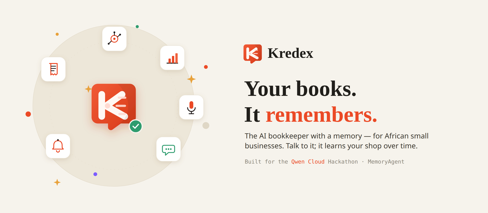
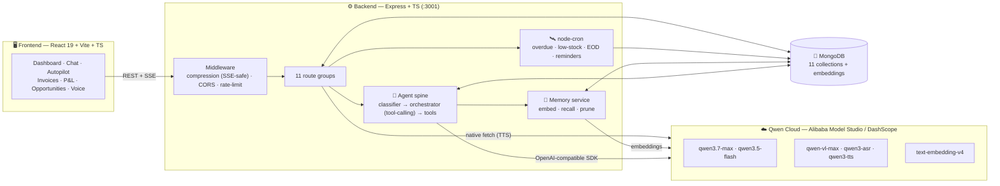

<!--  -->

# Kredex — AI Financial Autopilot for African Small Businesses

> An AI agent that runs the books for a micro-business by conversation. The owner
> just says what happened — in plain English or Nigerian Pidgin, typed or spoken —
> and Kredex records the sale, tracks the debt, watches the stock, and drafts the
> reminder. It **remembers** what you tell it across sessions (semantic memory),
> then **acts on its own** — scanning for overdue debts, low stock, and due
> reminders — and waits for your **yes** before anything goes out. Every action is
> shaped by what it remembers and logged on a visible timeline.

Built for the **Global AI Hackathon Series with Qwen Cloud** — **Autopilot Agent** track.

---

## Live

- 🎥 **Demo video** — _add link before submission_
- 🌐 **Live app** — _add Alibaba Cloud URL after deploy_
- 🗺️ **Architecture** — see [Architecture](#architecture) below
- 💻 **Repo** — https://github.com/shegz101/kredex

---

## Table of Contents

- [Quick Path](#quick-path)
- [Why It Stands Out](#why-it-stands-out)
- [What it does](#what-it-does)
- [Architecture](#architecture)
- [The agent layer](#the-agent-layer)
- [Requirements](#requirements)
- [Setup](#setup)
- [Usage](#usage)
- [Project layout](#project-layout)
- [License](#license)

---

## Quick Path

The shortest path from clone to a running app:

```bash
# 1. secrets — copy the template and fill in three values
cp server/.env.example server/.env
#    QWEN_API_KEY  (Alibaba Model Studio)  ·  MONGODB_URI  ·  JWT_SECRET

# 2. install everything (root + client + server)
npm run install:all

# 3. run both servers together (Vite :5173  +  Express :3001)
npm run dev
```

Then open **`http://localhost:5173`**, register a shop, and tell Kredex:

```text
> sold 3 bags of rice for 4500 each
> Musa carry 2 crates of coke, e go pay Friday
> remind me to call my supplier on Monday
> warn me when milk is below 10
```

---

## Why It Stands Out

Kredex is built for the Autopilot Agent track because it does three things
together that most "AI bookkeeping" demos don't:

- **It has real, persistent memory — not just a chat window.** Everything the
  owner tells Kredex is embedded and semantically recalled across sessions, so it
  behaves like a bookkeeper who actually *knows* your shop and your customers.
- **It acts autonomously, with a human checkpoint.** Background scanners detect
  overdue debts, low stock, and due reminders and raise approvals — nothing is
  ever sent without the owner's yes.
- **Memory and autopilot are fused.** When Kredex drafts a payment reminder, it
  uses what it remembers about that customer to set the tone — "always pays late
  but always pays" produces a patient message, not a pushy one — and shows you the
  exact memory that shaped it.

It speaks the owner's language (English + Nigerian Pidgin, typed **or spoken**),
reads receipt photos, and runs entirely on **Qwen** models via Alibaba Model Studio.

## What it does

- **Conversational bookkeeping** — the owner says what happened and Kredex does the
  accounting. A cheap local classifier routes the intent, then a Qwen tool-calling
  agent runs the right action against MongoDB and confirms in a sentence or two.
  Tools: `record_sale`, `record_credit_sale`, `record_payment`, `record_expense`,
  `log_stock`, `create_invoice`, `save_customer_phone`, `set_reminder`,
  `query_debts`, `query_stock`, `daily_summary`.
- **Persistent semantic memory (MemoryAgent)** — every message is embedded with
  `text-embedding-v4` (1024-dim) and stored; each new turn semantically recalls the
  most relevant past facts (cosine similarity) and injects them into the agent's
  context. Bounded by a per-shop cap with oldest-first pruning ("forgetting").
- **Autopilot with human-in-the-loop** — `node-cron` scanners (and an on-demand
  **Run scan now**) detect overdue debts (08:00), low stock (/6h), end-of-day
  summaries (21:00), and due reminders (/10min), raising deduped **approvals** the
  owner accepts or skips.
- **Memory-informed reminder drafting** — overdue-debt reminders are written by
  Qwen using recalled facts about the customer, tone-matched, with a safe template
  fallback. The memory used is shown on the card as **"🧠 Kredex remembered: …"**.
- **Real execution on approve** — approving a debt reminder opens a free WhatsApp
  (`wa.me`) message and records that it was sent; approving a low-stock alert puts
  the item on a **Restock list**; approving a reminder marks it done.
- **Activity timeline** — a visual, lifecycle feed (detected → decided + memory
  used → your checkpoint → action) for the whole autopilot loop.
- **Receipt photo OCR** — snap a supplier receipt; `qwen-vl-max` extracts
  structured line items to confirm and log.
- **Voice, both ways** — speak your entries (`qwen3-asr-flash`, speech-to-text) and
  have Kredex read replies aloud (`qwen3-tts-flash`, text-to-speech).
- **Invoices + PDF** — generate numbered invoices from chat or UI, mark paid/unpaid,
  download as PDF.
- **Profit & Loss analysis** — the flagship `qwen3.7-max` reasons over revenue,
  COGS, and expenses to give a plain-language "are you making money?" verdict.
- **Opportunity Scout** — finds grants, business events, and empowerment programs
  relevant to the shop via Qwen **live web search**, with source links and a cached,
  animated radar UI.
- **Dashboard & business health** — revenue chart, stat cards, low-stock and
  needs-attention panels, and a 0–100 business-health score (Strong / Good / Watch
  / At risk).
- **Currency-aware everywhere** — NGN / USD / GHS / KES / ZAR propagates across the
  dashboard, chat, invoices, and autopilot drafts.
- **Production hardening** — JWT auth (bcrypt, live email-taken check, password
  reset), rate limiting, SSE-safe gzip compression, in-memory TTL caching, and
  validated environment config.

## Architecture

A 3-tier app with an AI agent layer. **Qwen Cloud (Alibaba Model Studio / DashScope)
is the only external dependency** — reached through a single OpenAI-compatible
client, with a native DashScope call for text-to-speech.



**The Qwen model map** (`server/src/lib/qwen.ts` — one edit swaps a version):

| Model | Role in Kredex |
|---|---|
| `qwen3.7-max` | Deep P&L / profit reasoning |
| `qwen3.5-flash` | Chat tool-calling, opportunity scout |
| `qwen-vl-max` | Receipt photo OCR |
| `qwen3-asr-flash` | Speech-to-text (voice logging) |
| `qwen3-tts-flash` | Text-to-speech (talk-back) |
| `qwen3.5-omni-flash` | Voice (omni path) |
| `text-embedding-v4` | Semantic memory + fuzzy item matching |

## The agent layer

The heart of Kredex is a small, legible loop that fuses **memory** into
**autonomy**:

```text
Owner message
  -> local classifier (cheap intent guess, no LLM)
  -> orchestrator: recall relevant memories  ──►  Qwen (tool-calling)
       -> run tools against MongoDB
       -> stream the reply
  -> remember: embed + store the message for next time

Background (cron) / on-demand scan
  -> detect overdue debt / low stock / due reminder
  -> draft (memory-informed) + raise an Approval
  -> owner approves  ->  real action (WhatsApp / restock list / done)
  -> everything lands on the Activity timeline
```

- `server/src/agents/orchestrator.ts` — the Qwen tool-calling loop; injects recalled
  memories into the system prompt.
- `server/src/services/memory.ts` — `remember()` / `recall()` / `prune()`.
- `server/src/services/autopilot.ts` — scanners + memory-informed reminder drafting.

## Requirements

- **Node.js 20+** (developed on 24) and npm
- **MongoDB** — local (`mongodb://127.0.0.1:27017/kredex`) or a free MongoDB Atlas cluster
- A **Qwen Cloud API key** from Alibaba **Model Studio** (DashScope), OpenAI-compatible endpoint

## Setup

### 1. Configure environment
```bash
cp server/.env.example server/.env
```
Fill in `server/.env`:
- `QWEN_API_KEY` — from the Alibaba Cloud Model Studio console
- `QWEN_BASE_URL` — defaults to `https://dashscope-intl.aliyuncs.com/compatible-mode/v1`
- `MONGODB_URI` — local or Atlas connection string
- `JWT_SECRET` — a long random string:
  `node -e "console.log(require('crypto').randomBytes(32).toString('hex'))"`
- `PORT` — defaults to `3001`

### 2. Start MongoDB (if running locally)
```bash
sudo systemctl start mongod   # Linux; or run mongod / use MongoDB Atlas
```

### 3. Install and run
```bash
npm run install:all   # installs root, client, and server deps
npm run dev           # Express on :3001 + Vite on :5173, together
```

Open `http://localhost:5173` and register a shop.

## Usage

```bash
# Run both dev servers (client + server) with colored logs
npm run dev

# Run one side only
npm run dev:server
npm run dev:client

# Production build (client bundle + server tsc)
npm run build

# Verify the Qwen connection
npm --prefix server run ping:qwen
```

Try these in the chat once you're logged in:

```text
> sold 5 loaves of bread at 800 each
> Amaka took 3 cartons of milk on credit, due next week
> she paid 2000 today
> I paid 1500 for transport
> how much does Amaka owe me?
> what's low in stock?
> are you making money this month?
```

Then open **Autopilot → Run scan now** to see approvals, the restock list, and the
activity timeline populate.

## Project layout

```
server/src/
  index.ts             # Express app: middleware, route mounts, autopilot cron
  config/env.ts        # validated environment (fails loud on missing vars)
  agents/
    orchestrator.ts    # Qwen tool-calling agent loop + memory recall injection
    tools.ts           # function-calling tools (record_sale, log_stock, create_invoice…)
  services/
    memory.ts          # MemoryAgent: remember() / recall() / prune() (embeddings)
    autopilot.ts       # scanners + memory-informed Qwen reminder drafting
  lib/
    qwen.ts            # one OpenAI-compatible DashScope client + central model map
    embeddings.ts      # embed() + cosine() for semantic memory
    classifier.ts      # cheap local intent classifier (pre-LLM routing)
    cache.ts           # in-memory TTL cache        rateLimit.ts # api/auth/ai limiters
    money.ts           # currency formatting        stock.ts     # low-stock helpers
    jwt.ts             # sign/verify tokens          invoicePdf.ts# PDF generation
    db.ts              # Mongoose connection
  models/              # 11 Mongoose schemas incl. Memory.ts, Approval.ts
  routes/              # auth · chat · dashboard · autopilot · receipt · pnl ·
                       # invoices · settings · reminders · voice · opportunities
  middleware/auth.ts   # requireAuth (JWT)

client/src/
  Landing.tsx · App.tsx · main.tsx
  pages/               # Login · Register · ForgotPassword
  components/
    dashboard/         # DashboardPage · ChatPage · AutopilotPage · PnlPage ·
                       # InvoicesPage · OpportunitiesPage · RemindersPage ·
                       # SettingsPage · Sidebar · NotificationsDrawer · …
    Toast.tsx · …
  lib/api.ts           # typed API client (REST + SSE)
  hooks/ · utils/
```

## License

MIT — see [`LICENSE`](LICENSE).
```
